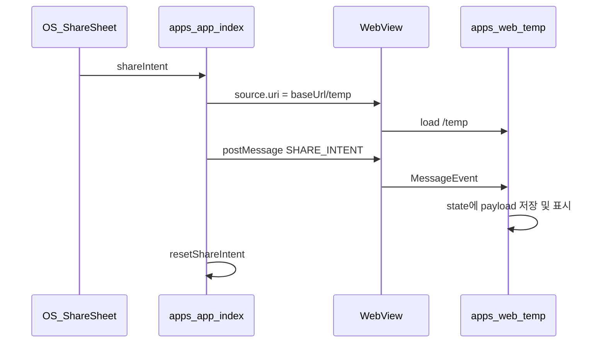

# ShareIntent → WebView `/temp` 전달 구현

## 현재 상태

- RN [`apps/app/app/index.tsx`](apps/app/app/index.tsx): `useShareIntentContext`로 intent를 받지만 `console.error` 후 `resetShareIntent()`만 수행
- WebBridge: RN→웹 [`apps/app/utils/webBridge.ts`](apps/app/utils/webBridge.ts) `postMessage`, 웹 수신 [`apps/web/src/hooks/useWebBridgeMessage.ts`](apps/web/src/hooks/useWebBridgeMessage.ts) (`window.addEventListener('message')`) 이미 구축
- [`packages/core`](packages/core): `WEBBRIDGE_MESSAGE_TYPE` 비어 있음, `WebBridgeMessageT`는 `{ type: string; payload?: Record<string, unknown> }`

## 데이터 흐름



**타이밍 이슈**: WebView가 아직 로드되기 전에 `postMessage`를내면 웹 리스너가 메시지를 놓칠 수 있음.  
→ **pending ref + `onLoadEnd`에서 전송** 패턴 사용. 이미 `/temp`에 있으면 `onLoadEnd` 없이 즉시 전송.

## 1. `@piki/core` — 공유 메시지 계약

[`packages/core/src/consts/webBridge.ts`](packages/core/src/consts/webBridge.ts)

```ts
export const WEBBRIDGE_MESSAGE_TYPE = {
  SHARE_INTENT: 'SHARE_INTENT',
} as const;
```

신규 [`packages/core/src/types/shareIntent.ts`](packages/core/src/types/shareIntent.ts)  
`expo-share-intent`의 `ShareIntent`와 동일한 직렬화 가능 shape (웹이 expo 패키지에 의존하지 않도록 core에 정의):

```ts
export type ShareIntentFileT = { fileName: string; mimeType: string; path: string; ... };
export type ShareIntentPayloadT = {
  meta?: Record<string, string | undefined> & { title?: string } | null;
  text?: string | null;
  files: ShareIntentFileT[] | null;
  type: 'media' | 'file' | 'text' | 'weburl' | null;
  webUrl: string | null;
};
```

[`packages/core/src/index.ts`](packages/core/src/index.ts)에서 `ShareIntentPayloadT` export.

## 2. RN 앱 — ShareIntent 처리

신규 [`apps/app/utils/serializeShareIntent.ts`](apps/app/utils/serializeShareIntent.ts)

- `expo-share-intent`의 `ShareIntent` → `ShareIntentPayloadT`로 필드별 명시 매핑 (any/타입 단언 없음)

[`apps/app/app/index.tsx`](apps/app/app/index.tsx) 변경:

| 항목                    | 내용                                                                                                                       |
| ----------------------- | -------------------------------------------------------------------------------------------------------------------------- |
| `WEB_BASE_URL`          | 상단 상수로 분리 (현재 하드코딩 `http://192.168.45.199:3000`, 추후 env 대체 용이)                                          |
| `webviewUri` state      | 초기값 `WEB_BASE_URL`, share 시 `${WEB_BASE_URL}/temp`                                                                     |
| `pendingShareIntentRef` | serialize된 payload 보관                                                                                                   |
| `useEffect` (share)     | `hasShareIntent` 시 payload 저장 → URI가 `/temp`면 즉시 `WebBridge.postMessage`, 아니면 URI 변경                           |
| `onLoadEnd`             | pending이 있으면 `WebBridge.postMessage(WEBBRIDGE_MESSAGE_TYPE.SHARE_INTENT, payload)` 후 `resetShareIntent()` + ref clear |
| 제거                    | `console.error('[SHARE]', ...)` 디버그 로그                                                                                |

```ts
// 핵심 로직 (개념)
useEffect(() => {
  if (!hasShareIntent) return;
  const payload = serializeShareIntent(shareIntent);
  pendingShareIntentRef.current = payload;

  if (webviewUri.endsWith('/temp')) {
    WebBridge.postMessage(WEBBRIDGE_MESSAGE_TYPE.SHARE_INTENT, payload);
    resetShareIntent();
    pendingShareIntentRef.current = null;
    return;
  }
  setWebviewUri(`${WEB_BASE_URL}/temp`);
}, [hasShareIntent, shareIntent, ...]);

const handleLoadEnd = () => {
  const pending = pendingShareIntentRef.current;
  if (!pending) return;
  WebBridge.postMessage(WEBBRIDGE_MESSAGE_TYPE.SHARE_INTENT, pending);
  resetShareIntent();
  pendingShareIntentRef.current = null;
};
```

`Webview`에 `source={{ uri: webviewUri }}`, `onLoadEnd={handleLoadEnd}` 연결.

## 3. 웹 — `/temp` 페이지

신규 [`apps/web/src/app/temp/page.tsx`](apps/web/src/app/temp/page.tsx) (`'use client'`)

- `useWebBridgeMessage`로 `type === WEBBRIDGE_MESSAGE_TYPE.SHARE_INTENT` 수신
- `payload`를 `ShareIntentPayloadT`로 좁히기: 필수 필드(`type`, `webUrl`, `files`) 존재 여부 type guard (any 없이)
- `useState<ShareIntentPayloadT | null>`에 저장 후 `<pre>{JSON.stringify(data, null, 2)}</pre>` 형태로 **Intent 원문 JSON 표시** (임시 디버그 UI)
- RN WebView가 아닌 브라우저 직접 접속 시: "WebView에서 공유 Intent를내면 표시됩니다" 안내

## 4. 검증 방법

1. `pnpm --filter piki-web dev` (포트 3000)
2. `apps/app`에서 WebView URI를 개발 PC LAN IP로 맞춤
3. iOS/Android 실기기 또는 시뮬레이터에서 Safari/Chrome URL 또는 텍스트 **공유 → PIKI**
4. WebView가 `/temp`로 이동하고 ShareIntent JSON이 화면에 표시되는지 확인
5. 연속 공유 시에도 payload가 갱신되는지 확인

## 범위 밖 (이번 작업 제외)

- `files[].path` 로컬 파일을 웹에서 실제 미리보기 (추후 base64 변환 또는 업로드 API 연동)
- `WEB_BASE_URL` env화 (주석/TODO만 남김)
- ShareIntent 기반 실제 위시리스트 저장 비즈니스 로직
