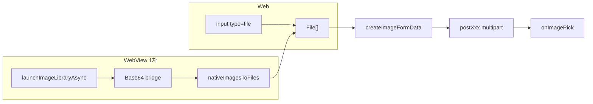
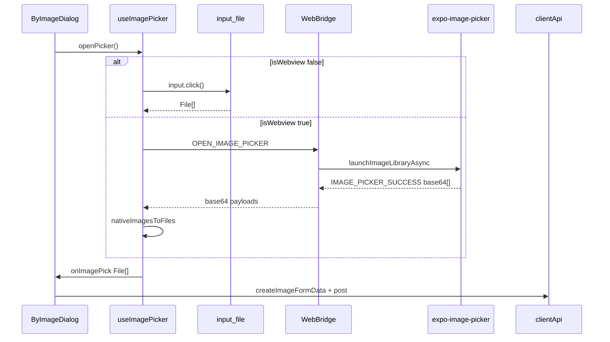

# 이미지 첨부 훅 설계 플랜

## 목표

[`useImagePicker`](apps/web/src/hooks/useImagePicker.ts)는 **이미지 선택(웹 / 웹뷰 분기)만** 담당합니다.

업로드·라우팅·API는 **`onImagePick` prop**으로 caller가 정의합니다.

```tsx
const { openPicker, inputRef, handleInputChange } = useImagePicker({
  maxCount: 5,
  onImagePick: async files => {
    const formData = createImageFormData(files);
    await postWishByImage(formData); // API 확정 후
  },
});
```

---

## 현재 제약 (중요)

**piki에는 retrip의 S3 presigned URL 업로드 로직이 없음** → 앱에서 업로드 후 URL만 웹에 넘기는 방식은 **지금 불가**.

|           | retrip                                   | piki (현재)                  |
| --------- | ---------------------------------------- | ---------------------------- |
| 앱 업로드 | `postPresignedUrl` + `putImageToS3` 있음 | **없음**                     |
| 웹뷰 결과 | `imageUrl` (경량)                        | **Base64 bridge 필요 (1차)** |

retrip 패턴은 **S3/API 인프라 갖춰진 이후**로 미루고, 지금은 Base64로 bridge → 웹에서 FormData 업로드.

---

## Base64 vs 앱 분리 — 1차 결론

**1차: Base64 bridge 사용** (빠른 선택지 없음)

- 느린 건 맞음 → 앱에서 **`quality` / `maxWidth` 압축**으로 완화
- caller 분기 없음 → **훅이 웹/웹뷰 모두 `File[]`로 정규화** 후 `onImagePick(files)` 호출

```ts
/** caller는 source 분기 없이 항상 File[] */
onImagePick: (files: File[]) => void | Promise<void>;
```

| 레이어    | 웹                           | 웹뷰 (1차)                |
| --------- | ---------------------------- | ------------------------- |
| 선택      | `input[type=file]`           | `launchImageLibraryAsync` |
| bridge    | —                            | Base64 payload            |
| 훅 정규화 | 그대로 `File[]`              | `nativeImagesToFiles()`   |
| caller    | `createImageFormData(files)` | **동일**                  |

**호출부 두 개로 나눌 필요 없음** — 느린 변환은 훅 내부에 숨김.

---

## 추후 전환 (S3/API 준비되면)

훅 **내부 adapter만 교체**, `onImagePick(files: File[])` 시그니처 유지:

```ts
/** 훅 내부 — caller 변경 없음 */
const resolveWebviewResult = async (payload) => {
  // 현재: nativeImagesToFiles(payload) → File[]
  // 추후: 앱 업로드 완료 시 fetch(blob) → File[] 또는 API가 URL만 받으면 caller API 변경 필요
};
```

S3 도입 시 retrip [`handleImageUpload.ts`](file:///Users/jungsuna/Desktop/retrip-fe/src/libs/utils/handleImageUpload.ts) 패턴으로 **앱 측 adapter 교체** 검토.

---

## Multipart/form-data 전략



- 웹·웹뷰 **모두 caller에서 FormData → axios**
- `Content-Type` 수동 설정 금지 (axios가 boundary 처리)

---

## 전체 흐름



---

## 1. `@piki/core` — WebBridge 메시지

| 방향      | type                   | payload                                                   |
| --------- | ---------------------- | --------------------------------------------------------- |
| WEB → APP | `OPEN_IMAGE_PICKER`    | `{ requestId, maxCount }`                                 |
| APP → WEB | `IMAGE_PICKER_SUCCESS` | `{ requestId, images: { base64, mimeType, fileName }[] }` |
| APP → WEB | `IMAGE_PICKER_CANCEL`  | `{ requestId }`                                           |
| APP → WEB | `IMAGE_PICKER_ERROR`   | `{ requestId, detail }`                                   |

---

## 2. `useImagePicker` 훅

```ts
type UseImagePickerOptions = {
  maxCount?: number;
  onImagePick: (files: File[]) => void | Promise<void>;
  onCancel?: () => void;
  onError?: (error: Error) => void;
};
```

### 책임

1. 환경 분기 (`isWebview`)
2. 웹 → input → `normalizeSelectedFiles` → `onImagePick(files)`
3. 웹뷰 → bridge → base64 수신 → `nativeImagesToFiles` → `onImagePick(files)`
4. pending / requestId / cleanup

### 웹 선택

- `input[type=file]` + `click()` only
- `showOpenFilePicker` **사용 안 함**

---

## 3. [`handleImage.ts`](apps/web/src/utils/handleImage.ts)

| 함수                     | 역할                         |
| ------------------------ | ---------------------------- |
| `normalizeSelectedFiles` | input → `maxCount` slice     |
| `base64ToFile`           | bridge 1건 → `File`          |
| `nativeImagesToFiles`    | bridge `images[]` → `File[]` |
| `createImageFormData`    | `File[]` → FormData          |

---

## 4. 앱 — picker만 (업로드 없음)

| 파일                                                             | 역할                                                      |
| ---------------------------------------------------------------- | --------------------------------------------------------- |
| [`apps/app/utils/handleImage.ts`](apps/app/utils/handleImage.ts) | URI → `{ base64, mimeType, fileName }` (expo-file-system) |
| [`apps/app/app/index.tsx`](apps/app/app/index.tsx)               | `OPEN_IMAGE_PICKER` → picker → bridge SUCCESS             |

```ts
await ImagePicker.launchImageLibraryAsync({
  mediaTypes: ['images'],
  allowsMultipleSelection: true,
  selectionLimit: maxCount,
  quality: 0.7,
  // 필요 시 allowsEditing, exif false 등으로 payload 축소
});
```

- **S3/API 업로드 로직 넣지 않음** (인프라 없음)
- retrip 업로드 코드는 **추후 S3 도입 시** 참고

---

## 5. 컴포넌트 마이그레이션

ByImageDialog, AddByImageDialog, ItemManualForm

```tsx
useImagePicker({
  maxCount: MAX_IMAGE_COUNT,
  onImagePick: async files => {
    const formData = createImageFormData(files);
    await postWishByImage(formData);
    onOpenChange(false);
  },
});
```

---

## 6. 구현 순서

1. core — bridge 타입 + Zod
2. web — `handleImage.ts` + `useImagePicker` (웹 경로)
3. app — picker + Base64 bridge (업로드 X)
4. web hook — 웹뷰 연동
5. 컴포넌트 마이그레이션
6. API — multipart 엔드포인트

---

## 리스크 / 주의사항

- **Base64 bridge payload**: `quality`/`maxWidth` 압축 필수, 5장 고해상도는 limit 주의
- **성능**: 1차 trade-off, S3 도입 후 adapter 교체로 개선
- **권한**: iOS/Android photo library permission (`app.json`)
- **postMessage size**: Android WebView에서 특히 주의 — 문제 시 S3 우선 구현
